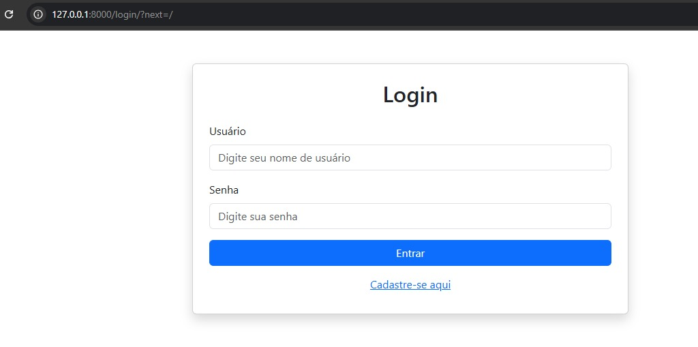
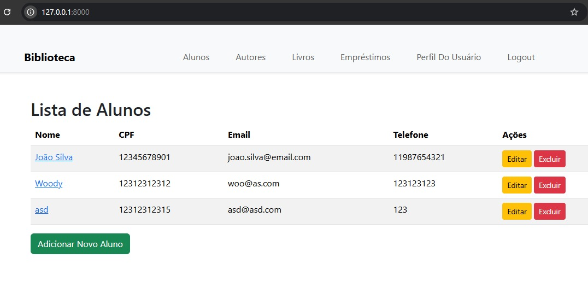
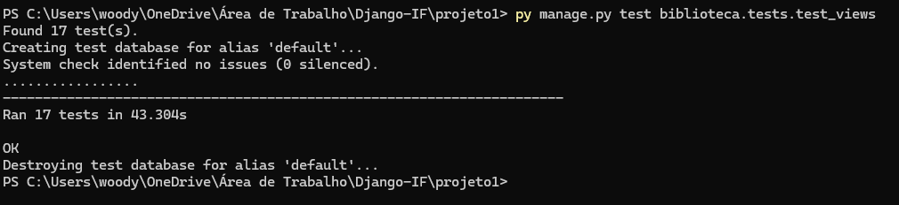
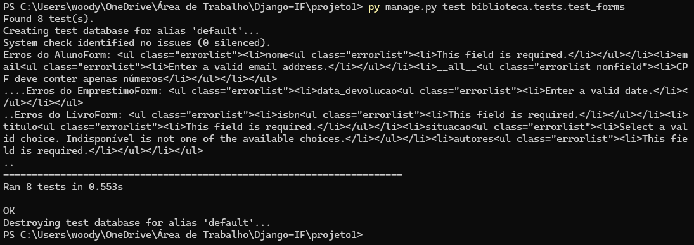
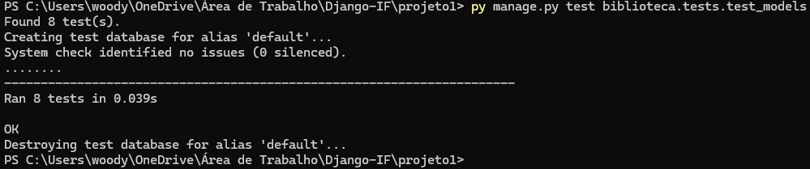

# projeto1-Django-IF

Este repositório contém o **Projeto 1** do curso **FIC - Desenvolvimento Web com o Framework Django**, oferecido pelo **Instituto Federal do Sertão Pernambucano**, Campus Petrolina. O objetivo do curso é ensinar os fundamentos do desenvolvimento web utilizando o framework Django.

---

## 📚 Sobre o Projeto

O **projeto1-Django-IF** é uma aplicação web que simula uma **Biblioteca**. Ele foi desenvolvido para consolidar os conceitos aprendidos durante o curso.

### 🚀 Funcionalidades

- **Tela de Login**:
  - Usuários devem se autenticar para acessar a aplicação.
  - Caso ainda não tenham conta, podem se cadastrar.

  

- **Lista de Alunos**:
  - Página inicial após o login, contendo uma lista de todos os alunos cadastrados.
  - Funcionalidades disponíveis:
    - **Adicionar Aluno**: Permite o cadastro de novos alunos.
    - **Editar Aluno**: Possibilidade de atualizar os dados de um aluno existente.
    - **Excluir Aluno**: Remove permanentemente um aluno.
    - **Visualizar Detalhes do Aluno**: Exibe informações detalhadas sobre o aluno.

  

- **Outras Páginas**:
  - **Autores**:
    - Gerenciamento de autores com as mesmas funcionalidades dos alunos.
  - **Livros**:
    - Cadastro, edição, exclusão e visualização de livros cadastrados.
  - **Empréstimos**:
    - Controle de empréstimos de livros, com possibilidade de registrar, editar e remover dados de empréstimos.
  - **Perfil do Usuário**:
    - Página para que o usuário visualize as informações de sua conta.
  - **Logout**:
    - Possibilidade de encerrar a sessão com segurança.

- **Barra de Navegação**:
  - Acesso rápido às diferentes seções da aplicação: Alunos, Autores, Livros, Empréstimos, Perfil do Usuário e Logout.

---

## 🛠️ Tecnologias Utilizadas

- **Linguagem de Programação**: Python
- **Framework Web**: Django
- **Banco de Dados**: SQLite (padrão do Django)
- **Frontend**:
  - HTML5
  - CSS3
  - Bootstrap 5

---

## 🧪 Testes

A aplicação possui um conjunto de testes automatizados para garantir a funcionalidade correta das views, formulários e modelos. Os testes foram organizados nos seguintes arquivos:

### 📌 test_views.py

- **LoginRequiredMixinTest**
  - `test_login_required_views`
- **AlunoViewTest**
  - `test_aluno_list_view`
  - `test_aluno_create_view`
  - `test_aluno_update_view`
  - `test_aluno_delete_view`
- **AutorViewTest**
  - `test_autor_list_view`
  - `test_autor_create_view`
  - `test_autor_update_view`
  - `test_autor_delete_view`
- **LivroViewTest**
  - `test_livro_list_view`
  - `test_livro_create_view`
  - `test_livro_update_view`
  - `test_livro_delete_view`
- **EmprestimoViewTest**
  - `test_emprestimo_list_view`
  - `test_emprestimo_create_view`
  - `test_emprestimo_update_view`
  - `test_emprestimo_delete_view`

  

### 📌 test_forms.py

- **AlunoFormTest**
  - `test_aluno_form_valid_data`
  - `test_aluno_form_invalid_data`
- **AutorFormTest**
  - `test_autor_form_valid_data`
  - `test_autor_form_invalid_data`
- **LivroFormTest**
  - `test_livro_form_valid_data`
  - `test_livro_form_invalid_data`
- **EmprestimoFormTest**
  - `test_emprestimo_form_valid_data`
  - `test_emprestimo_form_invalid_data`

  

### 📌 test_models.py

- **AlunoModelTest**
  - `test_cpf_deve_conter_apenas_numeros`
  - `test_cpf_deve_ter_11_digitos`
  - `test_telefone_deve_conter_apenas_numeros`
- **AutorModelTest**
  - `test_nome_autor_deve_ser_unico`
- **LivroModelTest**
  - `test_isbn_deve_ser_unico`
- **EmprestimoModelTest**
  - `test_nao_pode_emprestar_livro_ja_emprestado`
  - `test_data_devolucao_nao_pode_ser_anterior_ao_emprestimo`
  - `test_emprestimo_muda_situacao_do_livro_para_emprestado`

  

Para rodar os testes, utilize o seguinte comando:

```sh
python manage.py test biblioteca.tests.test_views
python manage.py test biblioteca.tests.test_forms
python manage.py test biblioteca.tests.test_models
```

---

Este projeto foi desenvolvido como parte do curso **FIC - Desenvolvimento Web com o Framework Django** no **Instituto Federal do Sertão Pernambucano**.

